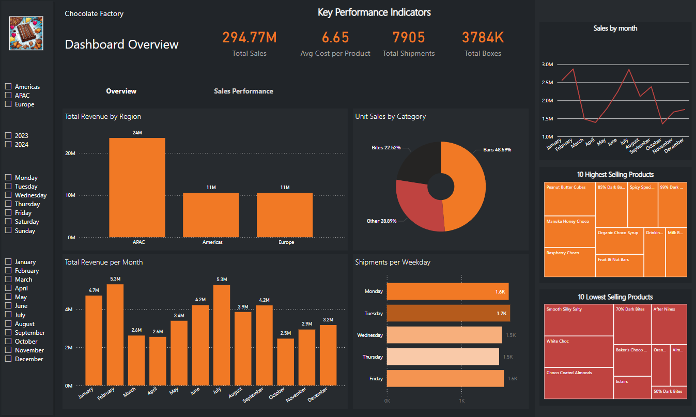
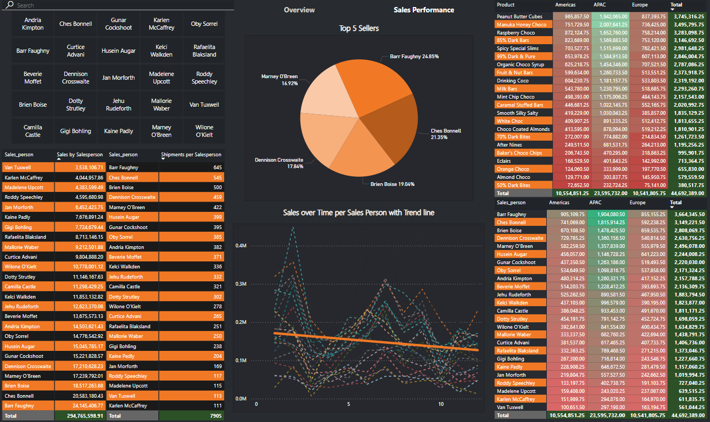

# Chocolate Bar Factory

## Problem Statement

Key Performance Indicators (KPIs):

Total Sales: 294.77M

Avg Cost per Product: 6.65

Total Shipments: 7,905

Total Boxes: 3,784K

Visualizations:

Total Revenue by Region: A stacked column chart showing sales in APAC, Americas, and Europe, with APAC being the largest contributor.

Unit Sales by Category: A pie chart displaying the distribution of sales by category, where "Bars" is the largest, followed by "Bites" and "Other."

Sales by Month: A line chart illustrating monthly sales fluctuations, with peaks around February and July.

Total Revenue per Month: A bar chart showing revenue per month, highlighting seasonal trends.

Shipments per Weekday: A bar chart displaying shipments by weekday, with Tuesday being the busiest day.

10 Highest Selling Products: A treemap highlighting top-selling products such as Peanut Butter Cubes and 85% Dark Bars.

10 Lowest Selling Products: A treemap showing the least popular products, including Smooth Silky Salty and 70% Dark Bites.

This page provides a clear overview of sales performance, identifies top and bottom-performing products, and highlights seasonal trends.

